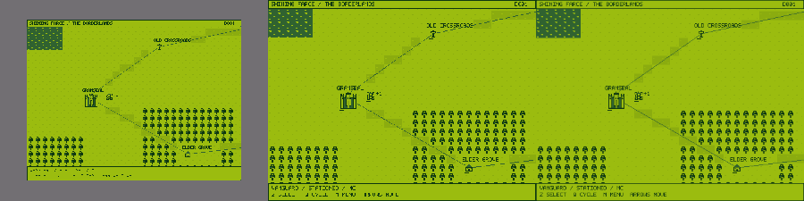

# Five presentation modes and responsive frameless — implementation report

Historical comparison report. The owner subsequently selected 300×225 Smooth; the [power/boot cleanup](POWER-BOOT-IMPLEMENTATION.md) supersedes these five modes, preference version and deferred power behavior. Original verification follows.

2026-09-27. Implementation and automated checks complete. New five-mode visual acceptance in Windows/Brave/file:// is pending owner testing; the preceding shell and its controls were already accepted by the owner.

## Baseline and evidence

HEAD was `14afe2c` (`End of Battle Scene Engine Phase 1`). The working tree already contained the previous accepted three-mode shell implementation and documentation, uncommitted. That work was preserved. Baseline deterministic suite: **984/984**.

The existing shell manager wrapped the 480×360 canvas with twelve replaceable native PNG layers, using fixed small 600×975 / large 780×1105 assemblies. Its display record v1 stored `presentationSize` 1/2/3. Logical action `presentation`, default H, and all held-state/wheel behavior were already present.

`git show HEAD:js/rendering/Renderer.js` confirms pre-shell responsive behavior: pixelated output, a window resize listener, and `max(1,floor(min(viewportWidth/480,viewportHeight/360)))`. That integer clamp cannot meet the new prompt's explicit full-viewport fit and below-native-window requirements. Mode 5 restores viewport responsiveness through the existing renderer/resize lifecycle and retains pixelated treatment, using the newly specified continuous fit calculation. This difference is explicit rather than claiming an exact restoration of the old formula.

## Five-mode implementation

`PRESENTATION_MODES` in `js/config/presentationShell.js` defines stable numeric mode IDs 1–5. Shell IDs 1/2 remain resource identities for the two existing assemblies; mode IDs no longer select shell assets directly. The same component nodes, canvas, input service and contrast state are reused.

| ID | Options label | Canvas CSS rectangle x,y,width,height | Sampling | Shell |
| --- | --- | --- | --- | --- |
| 1 | SMALL GB - 240x180 CRISP | 215,177,240,180 | pixelated | 600×975 |
| 2 | SMALL GB - 300x225 CRISP | 185,155,300,225 | pixelated | 600×975 |
| 3 | SMALL GB - 300x225 SMOOTH | 185,155,300,225 | auto | 600×975 |
| 4 | LARGE GB - 480x360 | 185,155,480,360 | pixelated | 780×1105 |
| 5 | FRAMELESS - RESPONSIVE | 0,0 within centered responsive wrapper | pixelated | none |

Logical canvas width/height remain **480×360** throughout. Modes 2/3 are geometrically identical. Mode 3 uses the canvas element's inline CSS `imageRendering='auto'`, overriding the default pixelated stylesheet only on that canvas. The browser interpolates the finished framebuffer; internal Canvas2D drawing retains disabled smoothing and canonical colors. No source artwork or game coordinates are changed. Neither new small mode is designated preferred.

Mode 1 has a separate unfiltered backing div at (185,155), 300×225, color **#726f73**. The game is inset 30 px left/right, **22 px top / 23 px bottom**, at integer coordinates (215,177). The backing belongs to the presentation DOM, not game pixels, shell PNGs, companion background, editor or shipping data. It is hidden in Modes 2–5. The canvas remains above the backing; all hardware images remain outside the SVG palette filter.

For Mode 5, `Renderer.setResponsiveDisplay()` computes:

```text
scale = min(window.innerWidth / 480, window.innerHeight / 360)
displayedWidth = 480 * scale
displayedHeight = 360 * scale
```

The renderer's existing resize listener recomputes those dimensions without reloading. `onDisplayResize` synchronizes the wrapper; flex auto margins center it with the existing companion background in unused space. Modes 1–4 use fixed dimensions and ignore viewport resize. They may require normal page scrolling. Examples: 1440×1080 viewport → 1440×1080 game; 240×160 → approximately 213.333×160; 1600×500 → approximately 666.667×500; 500×1200 → 500×375. Every case preserves 4:3 and the entire source rectangle.

The cycle remains the remappable `presentation` action, now **1→2→3→4→5→1**, default H. Options exposes meaningful mode labels, mapping to numeric IDs on commit. Existing API names `presentationSize`, `chooseSize` and `cycleSize` are retained to avoid unrelated changes. Only presentation properties are changed; campaign, battle, editor, menu and Working Copy objects are retained.

## Persistence and migration

The storage key remains **`shining-farce.display.v1`** so existing user preferences are found. Its new record format is version 2:

```json
{"version":2,"palette":"canonical","presentationMode":5}
```

| Existing v1 value | New mode |
| --- | --- |
| `presentationSize: 1` (small 300 crisp) | 2 |
| `presentationSize: 2` (large 480) | 4 |
| `presentationSize: 3` (frameless) | 5 |
| Palette only / absent / invalid size | 5, retaining a valid palette |

Version-2 mode IDs are restored directly, including Modes 1 and 3. Loading does not rewrite storage. The next explicit palette/mode save writes v2 in the same key, avoiding competing preference records. Invalid or unsupported records safely default as before. The committed palette is still separate from live preview, so mode saving cannot commit an unaccepted palette preview. Controls record v1, campaign schema 8, EditorDocument v1 and all authored shipping/portable formats remain unchanged.

## Preserved behavior and artwork

All four hardware modes share the same held input mappings, most-recently-pressed direction/fallback, Top On, Battery On, and contrast sequence. Actual active palette changes restart N/A/N/A/N/A/N at 200 ms intervals, finishing normal at 1200 ms. Shell-to-shell switches retain an active sequence. Mode 5 clears it and never queues hidden work; returning applies current held inputs and normal wheel until a new palette change. Contextual Select, live palette preview/Cancel, fixed menu footer and Stage-1 behavior remain in place. Input.js was not changed by this extension.

No source PNG was edited by this implementation. Verification identified the owner's manual revision to `assets/presentation/game-boy/size-1/select-button-pressed.png`; the owner explicitly confirmed that change during this task. It is preserved. `source-manifest.json` retains the original ZIP hashes, while `owner-revisions.json` records the intended current hash `4d71a3dbe9fd9901ccdd43b2e03a4ef35c63280dbb9f073d8492bcaa691cd553`. All 47 other copied source/reference PNGs still match the original ZIP. Verification checks that exact owner revision and rejects unrecorded changes unless explicitly invoked in diagnostic report mode.

The 46 external runtime shell resources and shipping completeness contract are unchanged. No new runtime file dependencies, updater step, fetch/XHR, server or remote assets were added. Palette validation allows only the single explicit presentation backing declaration in the shell configuration; it does not exempt arbitrary colors or change canonical PNG validation.

## Verification results

Final complete deterministic suite: **998/998**, a net increase of 14 checks. Existing shell geometry/default/cycle/storage tests now assert all five modes and v2 semantics. New coverage includes every legacy size migration, exact integer insets/backing/filter boundary, identical crisp/smooth geometry with differing sampling, larger/smaller/wide/tall responsive viewports, fixed shells on resize, held controls/contrast in all four shell modes, and meaningful Options choices. Existing action/remap, safe-switching, wheel restart, preview rollback, fixed-footer and Stage-1 assertions remain passing.

| Verification | Result |
| --- | --- |
| Full deterministic suite | 998/998 |
| Full offline rendering regression | Passed: campaign/UI, developer tools, combat, spells, palette and framebuffer checks |
| Stage-1 acceptance integration | 28/28 |
| Shipping page/installation fixtures | Passed, including 998 installed-page rule checks and inert authored data |
| Offline structure | 188 classic scripts, one stylesheet, zero missing/remote/fetch/XHR/syntax failures |
| Palette validation | 8 palettes, 37 canonical PNGs, 46 separate shell PNGs; no forbidden game colors or partial alpha |
| Shell source/composition checks | 47 original matches + one verified owner revision; all 46 native runtime resources present |
| Native reference comparison | Large: 0 differing pixels; small: unchanged 1,795 supplied component/reference differences |
| Five-mode offline comparison | All five rendered from the same complete campaign frame; backing pixel checks pass; crisp/smooth images differ |

Commands used (Canvas tools accept the existing local `@napi-rs/canvas` package path):

```text
node tools/test-foundation.cjs
node tools/verify-offline-structure.cjs
node tools/verify-rendering.cjs CANVAS_PACKAGE --output=TEMP_OUTPUT
node tools/verify-asset-acceptance.cjs CANVAS_PACKAGE
node tools/verify-shipping-page.cjs
node tools/verify-presentation-shell.cjs CANVAS_PACKAGE TEMP_OUTPUT/campaign-map.png
```

The full renderer invokes canonical palette validation. The legacy renderer's standalone integer-fit assertions remain valid for its fallback; new shell tests separately exercise the real Mode-5 responsive branch rather than repurposing those old checks.

## Offline comparison images

These are **offline Canvas2D renders, not Brave screenshots**. All five use the same actual campaign frame. The established regression exporter produces an integer-enlarged capture; the comparison tool first verifies every source block is identical before losslessly recovering the logical 480×360 frame. Browser CSS interpolation and SVG composition may differ from this offline interpolation implementation. These captures demonstrate geometry and sampling alternatives, not a preferred visual result.

- [Underlying logical frame](reference/game-boy/five-modes/underlying-game-frame.png)
- [Mode 1 — 240 Crisp](reference/game-boy/five-modes/mode-1.png)
- [Mode 2 — 300 Crisp](reference/game-boy/five-modes/mode-2.png)
- [Mode 3 — 300 Smooth](reference/game-boy/five-modes/mode-3.png)
- [Mode 4 — large](reference/game-boy/five-modes/mode-4.png)
- [Mode 5 — responsive at 1000×800 viewport](reference/game-boy/five-modes/mode-5.png), game 1000×750 with 25 px top/bottom companion background

Side by side, left to right: **Mode 1 / Mode 2 / Mode 3**, each showing the same 300×225 shell opening:



## Files changed by this extension

- `js/config/presentationShell.js`: five mode definitions; existing component geometry/paths unchanged.
- `js/rendering/PresentationShell.js`: shared mode selection, backing and responsive wrapper callback.
- `js/rendering/Renderer.js`: explicit responsive path using existing resize lifecycle.
- `js/rendering/DisplayPalette.js`: v2 display record and conservative v1 migration.
- `js/core/Game.js`: meaningful mode name in status output.
- `js/editor/DeveloperShell.js`: five descriptive Options values.
- `css/game.css`: noninteractive absolute backing layer.
- `js/debug/PresentationShellTests.js`: five-mode/migration/responsive coverage.
- `tools/verify-palette.cjs`: narrowly reviewed presentation backing color.
- `tools/shell-assets.cjs`: expose mode definitions to offline rendering.
- `tools/verify-presentation-shell.cjs`: five-mode same-frame renders, owner-revision verification and explicit mismatch diagnostics.
- `docs/reference/game-boy/owner-revisions.json` and `five-modes/`: owner-art provenance and seven offline comparison images.
- Current docs: canonical specification, README, architecture, asset README and recovery ledger; historical three-mode report annotated; this new report.

Other modifications shown by Git belong to the pre-existing uncommitted shell implementation and were preserved. No commit was created.

## Owner Windows / Brave / file:// acceptance

Open the updated project's `index.html` directly in your normal Brave profile. Use 100% browser zoom for dimension comparisons. Keep the complete project folders together. The existing saved small/large/frameless choice should initially appear as Mode 2/4/5 respectively. No saved preference starts Mode 5. Reopening still starts a fresh campaign under existing behavior; only display/control preference persistence is tested here.

1. **Cycle:** Press H (or your mapped control) repeatedly and confirm 240 Crisp → 300 Crisp → 300 Smooth → 480 Large → Responsive Frameless → 240 Crisp. Repeat with a menu open and during ordinary gameplay; state and current selections must remain intact.
2. **240 Crisp:** Verify the complete game is visible inside the small opening, with crisp half-size display, 30 px left/right and 22 top / 23 bottom. Check #726f73 backing and integer placement. Inspect all frame edges and menu text.
3. **300 Crisp:** Confirm the previous small 300×225 appearance remains available, filling the opening. Its existing pixel-reduction distortion has intentionally not been corrected or removed.
4. **300 Smooth:** Compare immediately with Mode 2 on the same menu/map. Geometry must remain identical; only interpolation changes. Judge readability in actual gameplay, without treating the offline image as definitive.
5. **Large:** Confirm the existing large shell, native 480×360 game, opening alignment, powered state and controls. Resize the window and confirm no shell shrinking. Scroll when necessary.
6. **Responsive:** In Mode 5 resize Brave larger, smaller, very wide and very tall. Confirm complete 4:3 game, no clipping/stretching, prompt updates without reload and companion margins. Return to shell modes and confirm their dimensions remain fixed.
7. **Persistence:** Choose several modes including 1 and 3, close/reopen the same path/profile and confirm exact restoration. Confirm existing palette survives too. Verify old small/large/frameless preferences migrate conservatively if testing an untouched old browser record.
8. **Input:** In each shell mode hold/release D-Pad, Accept/A, Cancel/B, Select and Start/Menu. Check keyboard/controller, held artwork after consumption, multiple directions/fallback, Top On and Battery On. Confirm your revised small Select-Pressed image remains present.
9. **Palette/wheel:** Change palettes normally and through Options live preview/Cancel. The game changes, shell colors stay authored, Mode-1 backing stays #726f73 and companion page color changes normally. Confirm three wheel movements at ~200 ms intervals and restart on rapid changes. Change palettes in Mode 5, return to a shell and confirm no delayed wheel work.
10. **Remapping/Options:** Find Cycle Presentation Size in keyboard/controller assignments, map it to an unused key/button, and confirm the new binding controls cycling rather than H. Verify the Presentation Mode field lists all five meaningful names and commits correctly. Check Options reachability and fixed Campaign Menu footer.

Report any issue with mode, viewport/zoom, palette and input/context. Remaining uncertainty is actual browser sampling/filter/layout behavior and cross-session file-URL preference restoration for the new record. No new Brave visual acceptance is claimed until these owner checks are performed.
